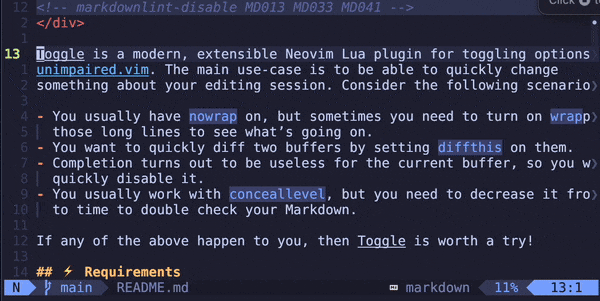

<!-- markdownlint-disable MD013 MD033 MD041 -->

<div align="center">
  <p>
    
  </p>
  <p>
    An extensible Neovim plugin for quickly toggling options.
  </p>
</div>

Toggle is a modern, extensible Neovim Lua plugin for toggling options ala
[unimpaired.vim][unimpaired]. The main use-case is to be able to quickly change
something about your editing session. Consider the following scenarios:

- You usually have `nowrap` on, but sometimes you need to turn on `wrap`ping for
  those long lines to see what’s going on.
- You want to quickly diff two buffers by setting `diffthis` on them.
- Completion turns out to be useless for the current buffer, so you want to
  quickly disable it.
- You usually work with `conceallevel`, but you need to decrease it from time
  to time to double check your Markdown.

If any of the above happen to you, then Toggle is worth a try!

## Example session



## ⚡️ Requirements

- Neovim 0.10+
- Optional plugin dependencies:
  - [Which Key][which-key]

## 📦 Installation

Install the plugin with your preferred package manager, such as [Lazy]:

```lua
{
  "gregorias/toggle.nvim",
  config = true,
}
```

## 🚀 Usage

## 🛠️ Configuration

### Setup

The default configuration setup looks like so:

```lua
require"toggle".setup{
  keymaps = {
    toggle_option_prefix = "yo",
    previous_option_prefix = "[o",
    next_option_prefix = "]o",
    status_dashboard = "yos"
  },
  -- The interface for registering keymaps.
  keymap_registry = require("toggle.keymap").keymap_registry(),
  -- See the default options section below.
  options_by_keymap = …,
}
```

### Default options

All default options use `vim.notify` for state changes.

| Option         | Keymap | Description                            |
| :--            | :--:   | :--                                    |
| background     | `b`    | dark-light switch                      |
| conceallevel   | `cl`   | 0–3 slider with 0-sticky toggle        |
| cursorline     | `-`    | on-off switch for `cursorline`         |
| diff           | `d`    | on-off switch for `diffthis`/`diffoff` |
| diff all       | `D`    | option for diffing all visible windows |
| list           | `l`    | on-off switch for `list`               |
| number         | `n`    | on-off switch for `number`             |
| relativenumber | `r`    | on-off switch for `relativenumber`     |
| wrap           | `w`    | on-off switch for `wrap`               |

## ✅ Comparison to Unimpaired

[Unimpaired][unimpaired] has more scope than Toggle, but it’s less extensible.

| Feature                            | Toggle | [Unimpaired][unimpaired] |
| :--                                | :--:   | :--:                     |
| [Which Key][which-key] integration | ✅     | ❌                       |
| [nvim-notify] integration          | ✅     | ❌                       |
| Extensible options                 | ✅     | ❌                       |
| Configurable keybindings           | ✅     | ❌                       |
| Slider (non-binary) option support | ✅     | ❌                       |

## 🙏 Acknowledgments

The idea of quickly toggling options using `yo`, `[o` `]o` came from
[unimpaired.vim][unimpaired].

The toggle SVG is a modified toggle icon from
[Arthur Shlain](https://usefulicons.com/).

## 🔗 See also

- [Coerce](https://github.com/gregorias/coerce.nvim) — My Neovim plugin for case coercion.

[Lazy]: https://github.com/folke/lazy.nvim
[nvim-notify]: https://github.com/rcarriga/nvim-notify
[unimpaired]: https://github.com/tpope/vim-unimpaired
[which-key]: https://github.com/folke/which-key.nvim
